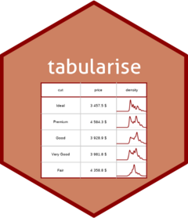

# tabularise - Create Tabular Outputs from R (using flextable) <a href="https://www.sciviews.org/chart"></a>

<!-- badges: start -->

[](https://github.com/SciViews/tabularise/actions/workflows/R-CMD-check.yaml) [](https://app.codecov.io/gh/SciViews/tabularise?branch=main) [](https://CRAN.R-project.org/package=tabularise) [](https://opensource.org/licenses/MIT) [](https://lifecycle.r-lib.org/articles/stages.html#experimental)

<!-- badges: end -->

With {tabularise} you should be able to obtain publication-ready (rich-formatted) tabular output from different R objects. It uses and enhances the excellent {flextable} package to build these tables and allow to output them in HTML, LaTeX/PDF, Word or PowerPoint.

## Installation

You can install the development version of {tabularise} from [GitHub](https://github.com/) with:

``` r
# install.packages("remotes")
remotes::install_github("SciViews/tabularise")
```

R should install all required dependencies automatically, and then it should compile and install {tabularise}.

## Example

A table can be generated from a data frame using:

``` r
library(tabularise)
tabularise(iris)
```

Get help about this package:

``` r
library(help = "tabularise")
help("tabularise-package")
vignette("tabularise") # Not installed with install_github()
```

For further instructions, please, refer to the help pages at <https://www.sciviews.org/tabularise/>.

## Code of Conduct

Please note that the {tabularise} package is released with a [Contributor Code of Conduct](https://contributor-covenant.org/version/2/1/CODE_OF_CONDUCT.html). By contributing to this project, you agree to abide by its terms.

