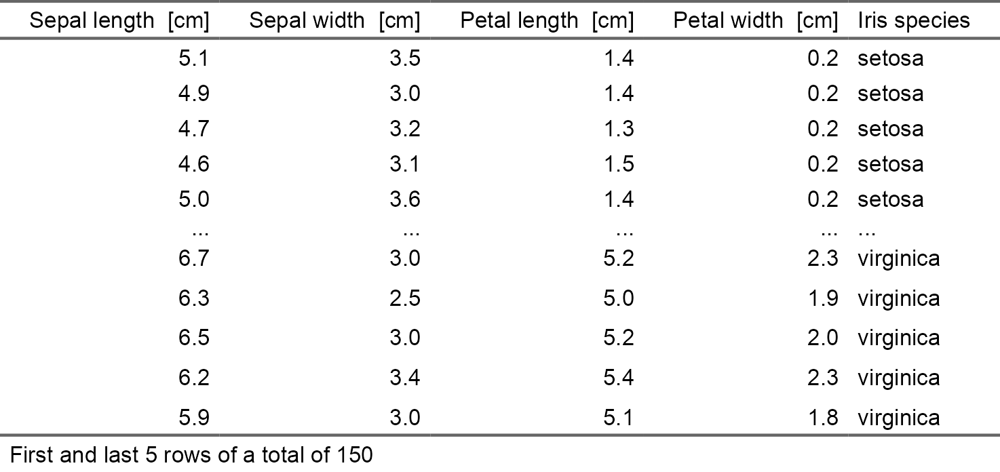

Tabularise - Rich-formatted Tabular Outputs from R
<a href='https://www.sciviews.org/tabularise'></a>
================

<!-- Do not edit the README.md file directly. It is generated from README.Rmd. -->
<!-- badges: start -->

[](https://github.com/SciViews/tabularise/actions/workflows/R-CMD-check.yaml)
[](https://app.codecov.io/gh/SciViews/tabularise?branch=main)
[](https://CRAN.R-project.org/package=tabularise)
[](https://opensource.org/licenses/MIT)
[](https://lifecycle.r-lib.org/articles/stages.html#experimental)

<!-- badges: end -->

With {tabularise} you should be able to obtain publication-ready
(rich-formatted) tabular output from different R objects. It uses and
enhances the {flextable} package to build these tables and allow to
output them in HTML, LaTeX/PDF, Word or PowerPoint. See
<https://www.sciviews.org/tabularise> for more details.

## Installation

{tabularise} is not available from CRAN yet. You should install it from
the [SciViews R-Universe](https://sciviews.r-universe.dev). The
{equatags} package is an optional dependency of {flextable} to manage
LaTeX equations in tables. The {data.io} package is useful too because
it manages labels and units that {chart} uses. To install those three
packages and their dependencies, run the following command in R:

``` r
install.packages(c('tabularise', 'equatags', 'data.io'),
  repos = c('https://sciviews.r-universe.dev', 'https://cloud.r-project.org'))
```

You can also install the latest development version of {tabularise}.
Make sure you have the {remotes} R package installed:

``` r
# install.packages("remotes")
remotes::install_github("SciViews/tabularise")
```

## Short example

Let’s take the well-known `iris` data frame, to which we add labels and
units.

``` r
data("iris")

# Add labels and units
iris <- data.io::labelise(iris,
  label = list(
    Sepal.Length = "Sepal length", Sepal.Width = "Sepal width",
    Petal.Length  = "Petal length", Petal.Width = "Petal width", 
    Species  = "Iris species"),
  units = list(
    Sepal.Length = "cm", Sepal.Width = "cm",
    Petal.Length  = "cm", Petal.Width = "cm"))
#> Registered S3 method overwritten by 'data.io':
#>   method             from  
#>   $.subsettable_type svMisc
```

Once the labels and units have been added to our data frame, the
`tabularise()` function uses them automatically in the tables it
produces.

``` r
library(tabularise)
tabularise$headtail(iris) # or tabularise(iris, type = "headtail")
```



{tabularise} is a central package used by several other packages in the
SciViews universe to format its tabular outputs. Variuous methods are
available for `tabularise()` and they are further enhanced by other
packages, such as [{inferit}](https://www.sciviews.org/inferit/) and
[{modelit}](https://www.sciviews.org/modelit/).

## Code of Conduct

Please note that the {tabularise} package is released with a
[Contributor Code of
Conduct](https://contributor-covenant.org/version/2/1/CODE_OF_CONDUCT.html).
By contributing to this project, you agree to abide by its terms.
